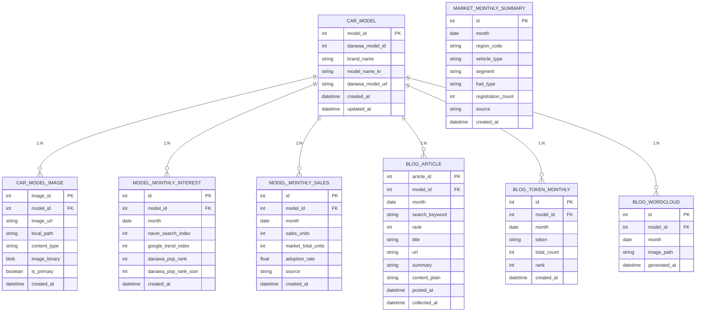

# DB 스키마 설계

> 기준 문서: `project_summary.md`  
> 변경사항: `car_model`을 **다나와 자동차 판매실적 사이트** 구조로 축소 + 썸네일 이미지용 테이블 추가




## 1. 공통 개념

- 기본 단위: **차량 모델 × 월(month)**.
- 대상 모델: 다나와 판매실적(모델 탭) 기준 **현대 / 기아** 모델.
- 데이터 소스:
  - 다나와 자동차: 인기순(랭킹), 판매실적(월별 판매대수)
  - 네이버 데이터랩: 검색량/검색지수
  - 구글 트렌드: 검색 트렌드 지수
  - 공공데이터: 등록현황(연료·차종·세그먼트 수준, 모델 직접 매핑 X)
  - 네이버 블로그: 상위 3개 글 + 워드 클라우드용 텍스트

자동 배치/ETL 파이프라인은 **나중에 추가** 전제로 하고,  
현재는 “사용자가 필요할 때 스크립트를 실행해서 테이블을 채운다”는 가정이다.

---

## 2. 차량 모델 정보 (다나와 기준, 미니멀 버전)

### 2-1. `car_model`

다나와 “판매실적 > 모델 탭” 기준으로 수집하는 **초간단 모델 마스터**.

- 다나와 기준 **Model 파라미터 값**이 핵심 식별자
- 브랜드/모델명/URL만 보관 (CRUD/조인용)

```sql
CREATE TABLE car_model (
    model_id         INT UNSIGNED AUTO_INCREMENT PRIMARY KEY COMMENT '내부 모델 ID',

    danawa_model_id  INT UNSIGNED NOT NULL COMMENT '다나와 newcar Model 파라미터 값',
    brand_name       VARCHAR(50)  NOT NULL COMMENT '브랜드명 (예: 현대, 기아)',
    model_name_kr    VARCHAR(200) NOT NULL COMMENT '다나와 기준 모델명 (예: 쏘나타 디 엣지)',
    danawa_model_url VARCHAR(500) NOT NULL COMMENT '다나와 newcar 모델 상세 URL',

    created_at       TIMESTAMP NOT NULL DEFAULT CURRENT_TIMESTAMP COMMENT '레코드 생성 시각',
    updated_at       TIMESTAMP NOT NULL DEFAULT CURRENT_TIMESTAMP ON UPDATE CURRENT_TIMESTAMP COMMENT '레코드 수정 시각',

    UNIQUE KEY uk_car_model_danawa_model_id (danawa_model_id),
    KEY idx_car_model_brand_name (brand_name, model_name_kr)
) COMMENT='다나와 판매실적(모델 탭) 기준 현대/기아 차량 모델 마스터';
```

- 다나와에서 크롤링 시:
  - 판매실적(모델 탭)에서 **모델명 링크 클릭 → newcar URL → Model 파라미터**를 `danawa_model_id`로 저장
  - 브랜드 탭/텍스트를 `brand_name`으로, 모델명 텍스트를 `model_name_kr`으로 저장
  - 링크 전체를 `danawa_model_url`에 저장

---

### 2-2. `car_model_image`

Streamlit에서 모델 목록을 보여줄 때 **썸네일 이미지도 같이 보여주기 위한 테이블**.

> 이미지 저장 전략은 2단계로 둘 수 있음:
> 1. **원본 URL + 로컬/버킷 경로만 DB에 저장** (권장)
> 2. 필요하면 `image_binary`에 썸네일 바이너리까지 저장 (용량 커질 수 있음)

```sql
CREATE TABLE car_model_image (
    image_id        INT UNSIGNED AUTO_INCREMENT PRIMARY KEY COMMENT '이미지 ID',
    model_id        INT UNSIGNED NOT NULL COMMENT 'car_model.model_id FK',
    
    image_url       VARCHAR(500) NOT NULL COMMENT '다나와에서 가져온 원본 이미지 URL',
    local_path      VARCHAR(500) NULL COMMENT '다운로드 받은 로컬/버킷 경로 (선택)',
    content_type    VARCHAR(100) NULL COMMENT 'MIME 타입 (예: image/jpeg)',
    
    -- 필요 시 사용 (썸네일 정도의 작은 이미지로만 저장하는 것을 추천)
    image_binary    LONGBLOB     NULL COMMENT '이미지 바이너리 (썸네일 수준, 선택)',
    
    is_primary      TINYINT(1) NOT NULL DEFAULT 1 COMMENT '대표 이미지 여부 (1=대표, 0=기타)',
    created_at      TIMESTAMP NOT NULL DEFAULT CURRENT_TIMESTAMP COMMENT '레코드 생성 시각',

    KEY idx_model_image_model_id (model_id),
    KEY idx_model_image_primary (model_id, is_primary)
) COMMENT='car_model별 썸네일/대표 이미지 정보 (Streamlit 목록용)';
```

**Streamlit에서의 사용 예시 개념**

- 목록 조회 시:
  1. `SELECT * FROM car_model`으로 모델 리스트를 가져오고
  2. 각 `model_id`에 대해 `car_model_image`에서 `is_primary = 1`인 이미지를 조인/조회
  3. `local_path`가 있으면 로컬/버킷 파일을, 없으면 `image_url`을 바로 사용
  4. `image_binary`를 쓴다면, Streamlit에서 `BytesIO`로 감싸서 이미지 렌더링

이미지 저장 방식을 나중에 바꾸더라도,  
`car_model`에는 아무 영향이 없고 `car_model_image`만 교체하면 되도록 분리했다.

---

## 3. 관심도 관련 테이블

### 3-1. `model_monthly_interest`

네이버 데이터랩, 구글 트렌드, 다나와 인기순(랭킹)을 **한 테이블에** 모은 구조.

```sql
CREATE TABLE model_monthly_interest (
    id                    INT UNSIGNED AUTO_INCREMENT PRIMARY KEY COMMENT 'PK',
    model_id              INT UNSIGNED NOT NULL COMMENT 'car_model.model_id FK',
    month                 DATE NOT NULL COMMENT '기준 월 (예: 2025-10-01)',

    naver_search_index    INT NULL COMMENT '네이버 검색량/검색지수 (원본 값)',
    google_trend_index    INT NULL COMMENT '구글 트렌드 지수 (0~100)',
    danawa_pop_rank       INT NULL COMMENT '다나와 인기순 랭킹 (1이 가장 인기)',
    danawa_pop_rank_size  INT NULL COMMENT '해당 랭킹이 산출된 전체 개수(선택)',

    created_at            TIMESTAMP NOT NULL DEFAULT CURRENT_TIMESTAMP COMMENT '레코드 생성 시각',

    UNIQUE KEY uk_interest_model_month (model_id, month),
    KEY idx_interest_month (month)
) COMMENT='모델별 월간 관심도 지표 (네이버/구글/다나와 인기순)';
```

---

## 4. 보급률(판매실적) 및 시장 요약

### 4-1. `model_monthly_sales`

다나와 “판매실적” 기준 **모델별 월간 판매대수**.

```sql
CREATE TABLE model_monthly_sales (
    id                 INT UNSIGNED AUTO_INCREMENT PRIMARY KEY COMMENT 'PK',
    model_id           INT UNSIGNED NOT NULL COMMENT 'car_model.model_id FK',
    month              DATE NOT NULL COMMENT '기준 월',
    
    sales_units        INT NOT NULL COMMENT '해당 모델의 월 판매량(대수)',
    market_total_units INT NULL COMMENT '같은 기준의 총 판매량 (현대+기아 또는 전체 시장, 선택)',
    adoption_rate      DECIMAL(7,4) NULL COMMENT '보급률 (sales_units / market_total_units, 선택)',

    source             VARCHAR(50) NOT NULL DEFAULT 'DANAWA' COMMENT '데이터 출처',
    created_at         TIMESTAMP NOT NULL DEFAULT CURRENT_TIMESTAMP COMMENT '레코드 생성 시각',

    UNIQUE KEY uk_sales_model_month (model_id, month),
    KEY idx_sales_month (month)
) COMMENT='모델별 월간 판매실적 (다나와 기준)';
```

---

### 4-2. `market_monthly_summary`

공공데이터 “등록현황” 요약 테이블 (모델 단위 X, 시장 흐름 보정용).

```sql
CREATE TABLE market_monthly_summary (
    id                 INT UNSIGNED AUTO_INCREMENT PRIMARY KEY COMMENT 'PK',
    month              DATE NOT NULL COMMENT '기준 월',
    region_code        VARCHAR(20)  NOT NULL COMMENT '지역 코드 (전국이면 KR 등)',
    vehicle_type       VARCHAR(50)  NULL COMMENT '차종 (승용, 승합, 화물, 이륜차 등)',
    segment            VARCHAR(50)  NULL COMMENT '세그먼트 (준중형, 중형, 대형, SUV, EV 등)',
    fuel_type          VARCHAR(50)  NULL COMMENT '연료 유형 (가솔린, 디젤, EV, HEV, LPG 등)',
    registration_count INT NOT NULL COMMENT '등록 대수',

    source             VARCHAR(100) NOT NULL COMMENT '공공데이터 파일/API 이름',
    created_at         TIMESTAMP NOT NULL DEFAULT CURRENT_TIMESTAMP COMMENT '레코드 생성 시각',

    KEY idx_market_month (month),
    KEY idx_market_filter (vehicle_type, fuel_type, segment)
) COMMENT='공공데이터 기반 월별 등록현황 요약 (시장 흐름 보정용)';
```

---

## 5. 네이버 블로그 및 워드 클라우드

### 5-1. `blog_article`

네이버 블로그 검색 결과 상위 3개 글 메타 + 정제 텍스트.

```sql
CREATE TABLE blog_article (
    article_id     INT UNSIGNED AUTO_INCREMENT PRIMARY KEY COMMENT '블로그 글 ID',
    model_id       INT UNSIGNED NOT NULL COMMENT 'car_model.model_id FK',
    month          DATE NOT NULL COMMENT '분석 기준 월 (검색 실행 월 기준)',

    search_keyword VARCHAR(200) NOT NULL COMMENT '검색에 사용한 키워드 (모델명 등)',
    rank           INT NOT NULL COMMENT '검색 결과 내 순위 (1~3)',

    title          VARCHAR(300) NOT NULL COMMENT '블로그 글 제목',
    url            VARCHAR(500) NOT NULL COMMENT '블로그 글 링크',
    summary        TEXT NULL COMMENT '네이버 API 요약/간단 요약 (선택)',
    content_plain  MEDIUMTEXT NOT NULL COMMENT 'HTML 제거 후 정제된 본문 텍스트',

    posted_at      DATETIME NULL COMMENT '블로그 작성/등록일 (파싱 가능시)',
    collected_at   TIMESTAMP NOT NULL DEFAULT CURRENT_TIMESTAMP COMMENT '검색 결과 수집 시각',

    KEY idx_blog_model_month (model_id, month),
    KEY idx_blog_model_rank (model_id, rank),
    UNIQUE KEY uk_blog_url (url)
) COMMENT='모델별 네이버 블로그 상위 글 메타 및 정제 텍스트';
```

---

### 5-2. `blog_token_monthly`

모델 × 월 단위 토큰(명사 등) 빈도 집계.

```sql
CREATE TABLE blog_token_monthly (
    id           INT UNSIGNED AUTO_INCREMENT PRIMARY KEY COMMENT 'PK',
    model_id     INT UNSIGNED NOT NULL COMMENT 'car_model.model_id FK',
    month        DATE NOT NULL COMMENT '기준 월',
    token        VARCHAR(100) NOT NULL COMMENT '토큰(명사 등)',
    total_count  INT NOT NULL COMMENT '해당 월 동안의 등장 횟수 (상위 3개 글 기준)',
    rank         INT NOT NULL COMMENT '해당 월/모델 내 순위 (1=최다 등장)',

    created_at   TIMESTAMP NOT NULL DEFAULT CURRENT_TIMESTAMP COMMENT '레코드 생성 시각',

    UNIQUE KEY uk_token_model_month (model_id, month, token),
    KEY idx_token_rank (model_id, month, rank)
) COMMENT='모델별 월간 블로그 키워드 빈도 (워드 클라우드용)';
```

---

### 5-3. `blog_wordcloud`

모델 × 월 단위 워드 클라우드 이미지 파일 정보.

```sql
CREATE TABLE blog_wordcloud (
    id           INT UNSIGNED AUTO_INCREMENT PRIMARY KEY COMMENT 'PK',
    model_id     INT UNSIGNED NOT NULL COMMENT 'car_model.model_id FK',
    month        DATE NOT NULL COMMENT '기준 월',

    image_path   VARCHAR(500) NOT NULL COMMENT '워드 클라우드 이미지 경로 (로컬/버킷 등)',
    generated_at TIMESTAMP NOT NULL DEFAULT CURRENT_TIMESTAMP COMMENT '워드 클라우드 생성 시각',

    UNIQUE KEY uk_wordcloud_model_month (model_id, month)
) COMMENT='모델별 월간 워드 클라우드 이미지 정보';
```

---

## 6. 테이블 관계 요약 (텍스트)

- `car_model (1)` ── `(N) model_monthly_interest`
- `car_model (1)` ── `(N) model_monthly_sales`
- `car_model (1)` ── `(N) car_model_image`
- `car_model (1)` ── `(N) blog_article`
- `car_model (1)` ── `(N) blog_token_monthly`
- `car_model (1)` ── `(N) blog_wordcloud`

`market_monthly_summary`는 특정 모델과 직접 연결되지 않고,  
`month` 기준으로만 **시장 전체 흐름**을 설명하는 용도로 사용한다.
