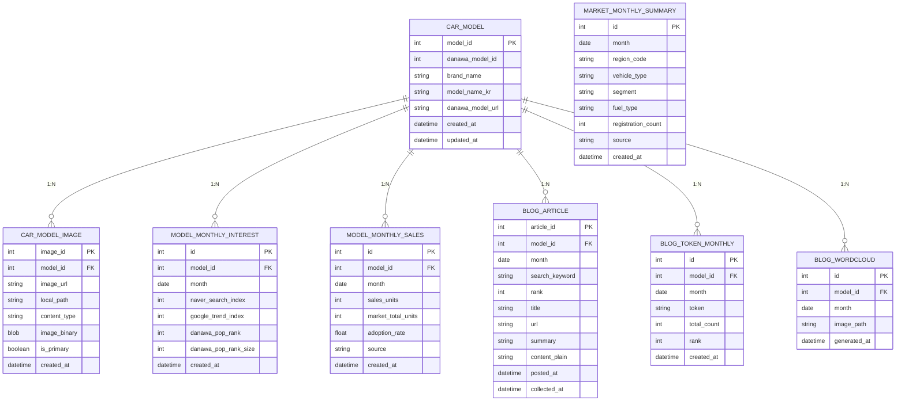

# DB ERD

```mermaid
erDiagram
    CAR_MODEL {
        int model_id PK
        int danawa_model_id
        string brand_name
        string model_name_kr
        string danawa_model_url
        datetime created_at
        datetime updated_at
    }

    CAR_MODEL_IMAGE {
        int image_id PK
        int model_id FK
        string image_url
        string local_path
        string content_type
        blob image_binary
        boolean is_primary
        datetime created_at
    }

    MODEL_MONTHLY_INTEREST {
        int id PK
        int model_id FK
        date month
        int naver_search_index
        int google_trend_index
        int danawa_pop_rank
        int danawa_pop_rank_size
        datetime created_at
    }

    MODEL_MONTHLY_SALES {
        int id PK
        int model_id FK
        date month
        int sales_units
        int market_total_units
        float adoption_rate
        string source
        datetime created_at
    }

    MARKET_MONTHLY_SUMMARY {
        int id PK
        date month
        string region_code
        string vehicle_type
        string segment
        string fuel_type
        int registration_count
        string source
        datetime created_at
    }

    BLOG_ARTICLE {
        int article_id PK
        int model_id FK
        date month
        string search_keyword
        int rank
        string title
        string url
        string summary
        string content_plain
        datetime posted_at
        datetime collected_at
    }

    BLOG_TOKEN_MONTHLY {
        int id PK
        int model_id FK
        date month
        string token
        int total_count
        int rank
        datetime created_at
    }

    BLOG_WORDCLOUD {
        int id PK
        int model_id FK
        date month
        string image_path
        datetime generated_at
    }

    CAR_MODEL ||--o{ CAR_MODEL_IMAGE : "1:N"
    CAR_MODEL ||--o{ MODEL_MONTHLY_INTEREST : "1:N"
    CAR_MODEL ||--o{ MODEL_MONTHLY_SALES : "1:N"
    CAR_MODEL ||--o{ BLOG_ARTICLE : "1:N"
    CAR_MODEL ||--o{ BLOG_TOKEN_MONTHLY : "1:N"
    CAR_MODEL ||--o{ BLOG_WORDCLOUD : "1:N"
```
